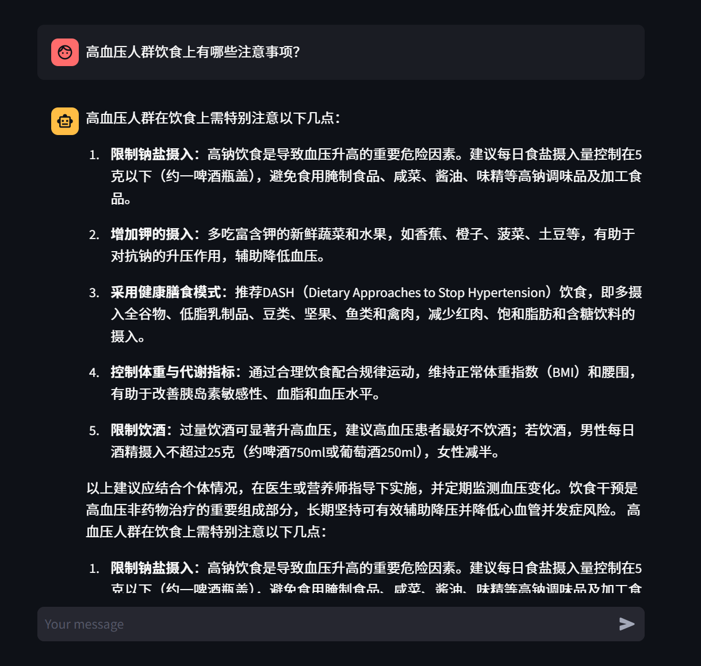
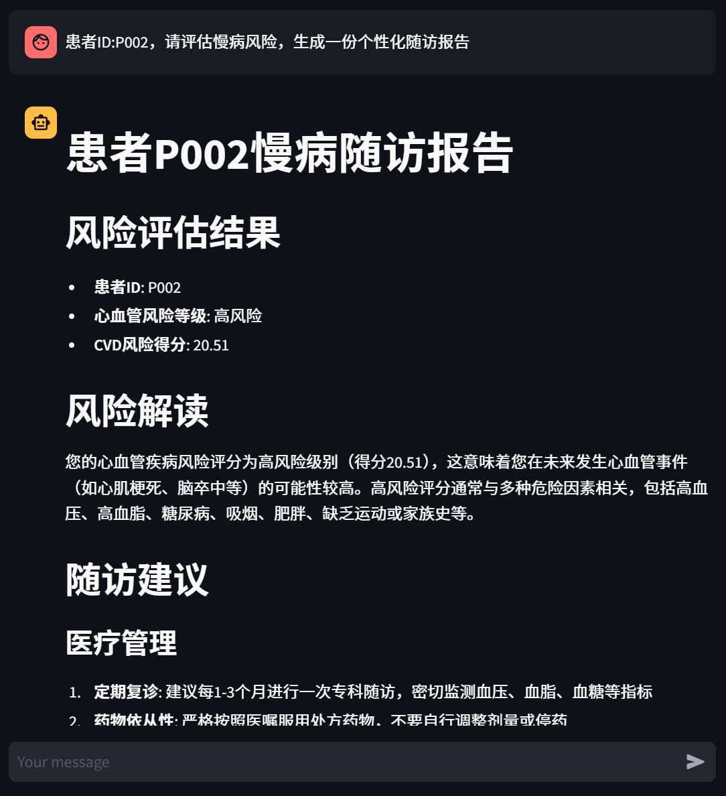
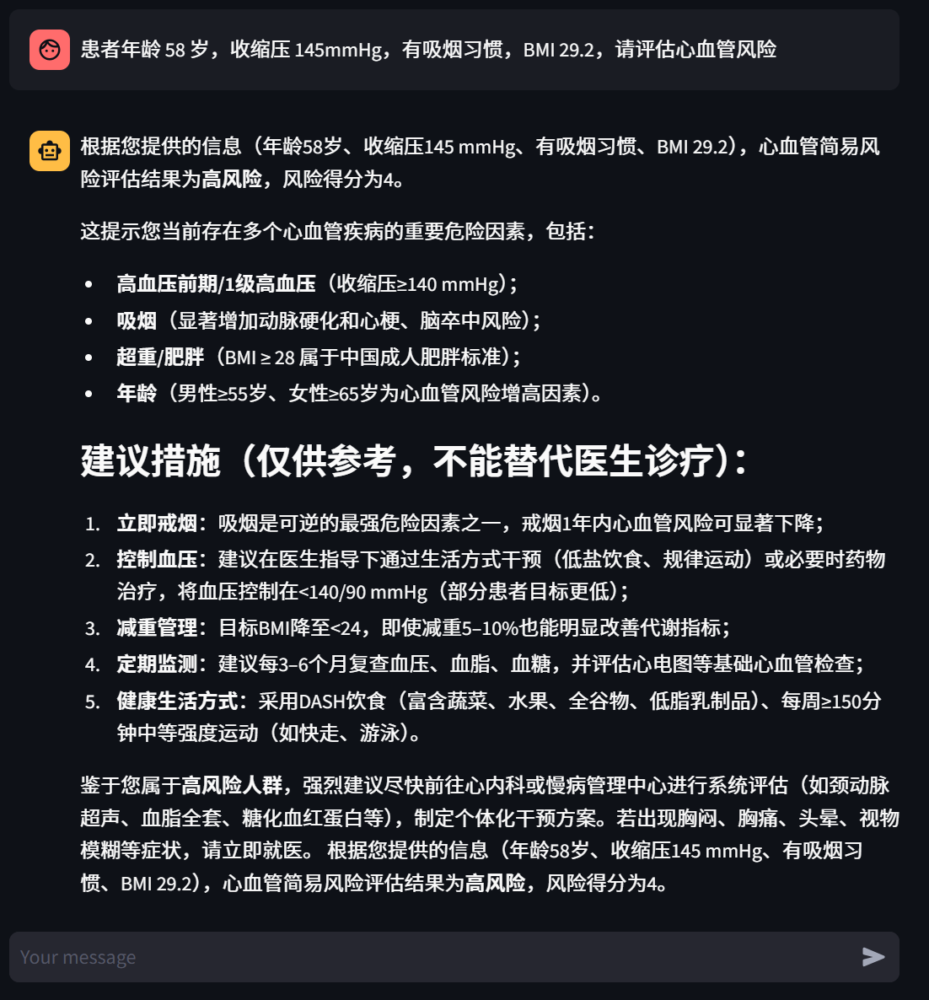

<div align="center">
# LangChain ReAct Agent · 生物医药慢病随访智能助手
**基于 LangChain + ReAct 范式 + RAG 检索增强的生物医药慢病随访智能助手**
[](https://www.python.org/)
&nbsp;
[](https://www.langchain.com/)
&nbsp;
[](https://github.com/langchain-ai/langgraph)
&nbsp;
[](https://streamlit.io/)
&nbsp;
[](./LICENSE)
</div>
---
## 项目简介
基于 LangChain 框架实现的 **ReAct（Reasoning + Acting）Agent**，集成生物医药知识库 RAG 检索增强、多工具调用和动态提示词切换。
系统能够根据用户意图自动判断任务类型（慢病知识问答 / 患者健康随访报告生成），调用合适的工具和生物医药知识库完成推理，并通过 Streamlit 流式界面实时展示 Agent 的思考与执行过程。

> ⚠️ **免责声明**：本项目仅用于技术演示科普，输出内容**不能替代执业医师的诊疗建议，不可直接用于临床诊断**。

## ✨ 功能一览
### 1) 知识库更新服务（Upload）
- Streamlit 页面上传 PDF / TXT 文件
- 自动读取解析文档文本内容
- 根据配置参数进行文本分段（RecursiveCharacterTextSplitter）
- 写入 **FAISS‑CPU** 向量库并本地持久化索引
- 使用 **MD5 文件去重**：已经入库过的文档不会重复向量化

### 2) 慢病智能问答（RAG Chat）
- Streamlit 网页聊天交互界面
- 会话历史自动保存（session_state）
- LangChain RAG 链路：`向量检索 → 提示词组装 → 大模型生成 → 流式返回`
- 回答逐字**流式输出**，体验顺滑
- 支持会话消息历史文件持久化存储（FileChatMessageHistory）

### 3) ReAct‑Agent 智能工具调度
- Agent 自主推理判断用户意图：区分普通问答 / 随访报告生成任务
- 按需调用知识库检索工具、患者随访数据工具
- 中间件监控工具调用日志，支持普通问答、报告生成两套提示词动态切换

### 4) 慢病随访报告生成
- 读取模拟患者健康数据
- 基于知识库参考内容生成个性化慢病随访评估报告


### 5）效果展示
<div align="center">

*图1. 普通问答 — RAG 检索生物医药知识库回复*
&nbsp;

*图2. Agent 工具调用 — 实时展示推理与工具执行链路*
&nbsp;

*图3. 工具调用详情 — 多步推理与慢病随访报告生成*
&nbsp;
</div>
## 技术架构
<div align="center">
用户输入 (Streamlit)
│
▼
┌─────────────────────────────────────────┐
│            ReAct Agent                   │
│                                          │
│  ┌──────────┐    ┌──────────────────┐   │
│  │ Thought  │───→│     Action       │   │
│  │ (推理)    │    │ (工具调用 / RAG)  │   │
│  └──────────┘    └────────┬─────────┘   │
│       ↑                   │              │
│       └─── Observation ◄──┘              │
│                                          │
│   Middleware: 工具监控・动态提示词切换    │
└─────────────────────────────────────────┘
│                │              │
▼                ▼              ▼
┌──────────┐   ┌────────────┐  ┌──────────┐
│   RAG    │   │   Tools    │  │  Prompt  │
│  FAISS   │   │患者随访数据 │  │  动态切换  │
│ 向量检索  │   │ 报告生成   │  │  模板管理  │
└──────────┘   └────────────┘  └──────────┘
</div>
### 核心特性
| 特性 | 说明 |
|---|---|
| **ReAct 范式** | Thought → Action → Observation 循环，Agent 自主推理并决定调用哪个工具 |
| **RAG 检索增强** | FAISS‑CPU 向量库 + DashScope Embedding，MD5 文件去重，支持 txt/pdf 医学文档混合加载 |
| **多工具调用** | 患者数据查询、随访报告生成、外部医学资料检索，Agent 按需自动选择 |
| **动态提示词切换** | Middleware 根据运行时上下文自动切换「普通慢病问答」与「随访报告生成」两套 System Prompt |
| **流式对话界面** | Streamlit 构建，支持流式逐字输出、历史消息留存、Agent 推理过程可见 |
| **模块化结构** | Agent / RAG / Model / Tools / Middleware 独立模块，配置 YAML 驱动 |

## 技术栈
| 层级 | 技术 |
|---|---|
| LLM | 通义千问（DashScope / ChatTongyi） |
| Agent 框架 | LangChain + LangGraph |
| 向量数据库 | FAISS‑CPU |
| 文档处理 | PyPDF + RecursiveCharacterTextSplitter |
| 前端 | Streamlit |
| 配置 | YAML 驱动（Agent / RAG / FAISS / Prompts） |

## 快速开始
### 环境要求
- **Python** ≥ 3.10
- **DashScope API Key**（[阿里云百炼](https://bailian.console.aliyun.com/) 申请）

### 1. 克隆仓库
```bash
git clone https://github.com/Huangyinzhi/你的仓库名.git
cd 你的仓库名
```
### 2. 安装依赖

```
pip install -r requirements.txt
```
### 3. 配置 API Key

项目根目录新建 `.env` 文件写入密钥：

```
DASHSCOPE_API_KEY="your-api-key"
```
### 4. 初始化知识库（首次运行）

```
python -c "from rag.vector_store import VectorStoreService; VectorStoreService().load_document()"
```
### 5. 启动应用

```
streamlit run app.py
```
浏览器自动打开  [http://localhost:8501](http://localhost:8501)

### 验证运行

启动后在聊天框输入以下测试问题：

- *糖尿病患者日常饮食注意事项有哪些？*（RAG 知识库问答）
- *高血压药物漏服后应当如何处理？*（慢病知识咨询）
- *请根据患者数据生成一份慢病随访健康评估报告*（报告生成 + 工具调用）

## 项目结构LangChain‑ReAct‑Agent‑Biomedical/
│
├── agent/                          # Agent 核心
│   ├── react_agent.py              #   ReAct Agent 主逻辑（流式执行）
│   └── tools/
│       ├── agent_tools.py          #   工具函数（RAG检索/患者数据/随访报告）
│       └── middleware.py           #   中间件（工具监控/动态提示词切换）
│
├── rag/                            # RAG 检索增强
│   ├── vector_store.py             #   FAISS 向量库 · 文档加载 · MD5 去重
│   └── rag_service.py              #   RAG 检索 → LLM 总结服务
│
├── model/
│   └── factory.py                  # 模型工厂（ChatTongyi + DashScopeEmbedding）
│
├── config/                         # YAML 配置文件
│   ├── agent.yml                   #   Agent 行为与工具配置
│   ├── faiss.yml                   #   向量库与检索参数
│   ├── prompts.yml                 #   提示词模板
│   └── rag.yml                     #   RAG 模型与参数
│
├── prompts/                        # 提示词模板
│   ├── main_prompt.txt             #   普通问答 System Prompt
│   ├── rag_summarize.txt           #   RAG 总结 Prompt
│   └── report_prompt.txt           #   随访报告生成 System Prompt
│
├── utils/                          # 工具函数
│   ├── config_handler.py           #   YAML 配置加载
│   ├── file_handler.py             #   文件解析（PDF/TXT）
│   ├── logger_handler.py           #   日志管理
│   ├── path_tool.py                #   路径工具
│   └── prompt_loader.py            #   提示词加载
│
├── data/                           # 生物医药知识库文档
├── faiss_index/                    # FAISS向量索引目录（不上传GitHub）
├── assets/                         # 效果展示截图
├── app.py                          # Streamlit 应用入口
├── requirements.txt
└── README.md
## 配置说明

项目通过 `config/` 目录下的 YAML 文件统一管理配置：

表格

| 文件 | 说明 |
| --- | --- |
| `rag.yml` | 对话模型名称、Embedding 模型名称 |
| `faiss.yml` | FAISS 持久化路径、分块大小、检索 Top‑K、支持的文件类型 |
| `prompts.yml` | 各场景提示词模板文件路径 |
| `agent.yml` | Agent 超时时间、患者随访数据路径等 |

首次运行只需确保 **DashScope API Key 已设置** 且 `data/` 目录下有生物医药知识库文档即可。

## License

MIT © [Huangyinzhi](https://github.com/Huangyinzhi)

